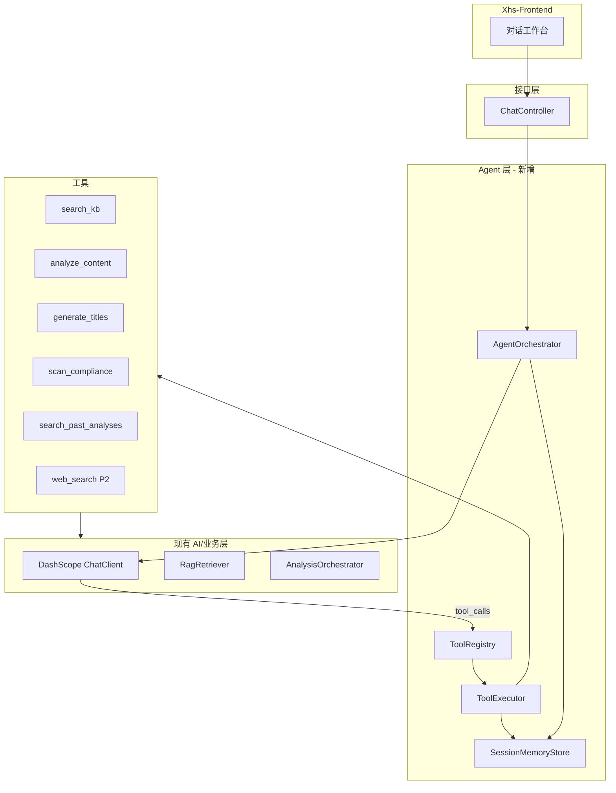

# Agent 工具调用开发设计

> 版本：`agent-1.0.0`  
> 日期：2026-06-01  
> 依赖：[TECH-ARCHITECTURE.md](./TECH-ARCHITECTURE.md)、[RAG-DESIGN.md](./RAG-DESIGN.md)、[PRD-V3.0.md](./PRD-V3.0.md)

---

## 1. 目标与边界

### 1.1 目标

在现有「单次 Prompt → JSON 报告」流水线之上，引入 **Agent 工具调用循环**，使 LLM 能按需：

- 检索垂类知识库（RAG）
- 调用已有业务能力（分析、标题、合规、封面）
- 查询用户历史任务
- （P2）联网搜索、抓取 URL、获取热点选题

最终形态：用户通过 **多轮对话** 完成「分析 → 追问 → 生成标题 → 优化稿」等运营工作流，而非每次手动点不同 API。

### 1.2 产品边界（PRD 约束）

| 做 | 不做 |
|----|------|
| 人工在环：所有输出可编辑 | 自动发帖、评论、私信 |
| 分析优先，生成为辅 | Agent 全自动运营 |
| 粘贴 + 截图输入 | 小红书官方 API 爬虫 |
| 工具结果可追溯、可审计 | 无配额限制的无限联网 |

### 1.3 与现有系统关系

```
现有（保留）                    新增（Agent 层）
─────────────────────────────────────────────────
AnalysisOrchestrator     ←──   analyze_content 工具包装
TitleService             ←──   generate_titles 工具包装
ComplianceChecker        ←──   scan_compliance 工具包装
CoverAnalysisService     ←──   analyze_cover 工具包装
RagRetriever             ←──   search_kb 工具包装
AnalysisAppService       ←──   get/list 历史任务工具
```

现有 REST API（`/v1/analysis` 等）**不删除**，Agent 对话是增量能力；前端可逐步从「表单 + 轮询」迁移到「对话 + 卡片展示」。

---

## 2. 架构总览



### 2.1 Agent 循环（ReAct / Function Calling）

```
1. 加载 session 上下文（Redis + DB messages）
2. 组装 system prompt + tools schema
3. 调用 LLM
4. 若 response 含 tool_calls：
     a. 校验工具名与参数
     b. ToolExecutor 执行（带超时）
     c. 将 tool result 追加到 messages
     d. 回到步骤 3（step++）
5. 若 response 为纯文本 / 结构化卡片 → 持久化 assistant message → 返回前端
6. 超过 maxSteps 或总超时 → 返回 50402 agent_timeout
```

---

## 3. 分期实施

### Phase 1 — 最小可用 Agent（优先开发）

**交付标准：** 对话中可以完成「粘贴草稿 → 自动分析 → 追问评分细节 → 生成标题」，全程不依赖外网。

| 模块 | 内容 |
|------|------|
| 基础设施 | `ToolRegistry`、`ToolExecutor`、`AgentOrchestrator` |
| 记忆 | Redis 会话上下文 + `chat_session` / `chat_message` 表 |
| 工具 | `search_kb`、`analyze_content`、`generate_titles`、`scan_compliance`、`get_analysis_report`、`list_recent_analyses` |
| API | `POST /v1/chat/sessions`、`POST /v1/chat/sessions/{id}/messages` |
| Mock | 所有工具均有 mock 实现，对齐 `AiRuntimePolicy` |

### Phase 2 — 联网与增强

| 模块 | 内容 |
|------|------|
| 工具 | `web_search`、`fetch_url` |
| 记忆 | 用户长期偏好（`users.agent_preferences JSONB`） |
| 配额 | 联网工具单独计数 |
| 审计 | `agent_tool_log` 表 |

### Phase 3 — 热点与 MCP（P2 产品）

| 模块 | 内容 |
|------|------|
| 工具 | `get_hot_topics`、`get_industry_calendar` |
| MCP | 内置工具暴露为 MCP Server；可选接入外部 MCP |

---

## 4. 包结构

在 `com.shortvideoscripagent.xhsagentyunying.ai` 下新增：

```
ai/
├── agent/
│   ├── AgentOrchestrator.java       # 主循环
│   ├── AgentRequest.java            # sessionId, userMessage, attachments
│   ├── AgentResponse.java           # assistantMessage, toolTraces, cards
│   ├── AgentRuntimePolicy.java      # enabled / maxSteps / mock
│   ├── memory/
│   │   ├── SessionMemoryStore.java  # 接口
│   │   ├── RedisSessionMemoryStore.java
│   │   └── ChatHistoryService.java  # DB 持久化
│   ├── tool/
│   │   ├── AgentTool.java           # 工具接口
│   │   ├── ToolRegistry.java
│   │   ├── ToolExecutor.java
│   │   ├── ToolContext.java         # userId, sessionId, taskId
│   │   ├── ToolResult.java
│   │   └── impl/
│   │       ├── SearchKbTool.java
│   │       ├── AnalyzeContentTool.java
│   │       ├── GenerateTitlesTool.java
│   │       ├── ScanComplianceTool.java
│   │       ├── GetAnalysisReportTool.java
│   │       ├── ListRecentAnalysesTool.java
│   │       ├── WebSearchTool.java          # Phase 2
│   │       └── FetchUrlTool.java           # Phase 2
│   └── prompt/
│       └── AgentSystemPrompt.st        # classpath prompts/agent-system.st
├── orchestrator/                       # 现有，不变
├── rag/                                # 现有，search_kb 调用 RagRetriever
└── ...
```

应用层与接口层：

```
service/
└── ChatAppService.java

controller/v1/
└── ChatController.java

dto/chat/
├── ChatSessionCreateRequest.java
├── ChatSessionResponse.java
├── ChatMessageSendRequest.java
└── ChatMessageResponse.java

domain/entity/
├── ChatSession.java
└── ChatMessage.java
```

---

## 5. 数据库设计

新增 Flyway：`V4__chat_agent.sql`

```sql
-- 对话会话
CREATE TABLE app.chat_session (
    id              VARCHAR(32) PRIMARY KEY,
    user_id         BIGINT NOT NULL REFERENCES app.users(id),
    title           VARCHAR(128),
    persona         VARCHAR(32) DEFAULT 'agency',
    linked_task_id  VARCHAR(32) REFERENCES app.analysis_task(id),
    status          VARCHAR(16) NOT NULL DEFAULT 'active',  -- active | archived
    created_at      TIMESTAMPTZ NOT NULL DEFAULT NOW(),
    updated_at      TIMESTAMPTZ NOT NULL DEFAULT NOW()
);

CREATE INDEX idx_chat_session_user ON app.chat_session (user_id, updated_at DESC);

-- 对话消息
CREATE TABLE app.chat_message (
    id              BIGSERIAL PRIMARY KEY,
    session_id      VARCHAR(32) NOT NULL REFERENCES app.chat_session(id) ON DELETE CASCADE,
    role            VARCHAR(16) NOT NULL,   -- user | assistant | tool | system
    content         TEXT,
    tool_calls      JSONB,                  -- assistant 发起的工具调用
    tool_call_id    VARCHAR(64),            -- tool 角色消息关联
    tool_name       VARCHAR(64),
    metadata        JSONB NOT NULL DEFAULT '{}'::jsonb,  -- cards, taskId, tokens
    created_at      TIMESTAMPTZ NOT NULL DEFAULT NOW()
);

CREATE INDEX idx_chat_message_session ON app.chat_message (session_id, id);

-- Phase 2：工具调用审计
CREATE TABLE app.agent_tool_log (
    id              BIGSERIAL PRIMARY KEY,
    session_id      VARCHAR(32) NOT NULL,
    user_id         BIGINT NOT NULL,
    tool_name       VARCHAR(64) NOT NULL,
    input_json      JSONB,
    output_summary  TEXT,
    success         BOOLEAN NOT NULL,
    latency_ms      INT,
    created_at      TIMESTAMPTZ NOT NULL DEFAULT NOW()
);

CREATE INDEX idx_agent_tool_log_user_day ON app.agent_tool_log (user_id, created_at);
```

### 5.1 Redis 会话缓存

| Key | 格式 | TTL | 内容 |
|-----|------|-----|------|
| `agent:session:{sessionId}` | Hash | 24h | `persona`, `linkedTaskId`, `lastMessageId` |
| `agent:ctx:{sessionId}` | List | 24h | 最近 N 条 message 摘要（JSON），用于快速拼 prompt |

刷新策略：每次 `POST messages` 后 `EXPIRE` 续期；超过 50 条消息时从 DB 加载更早历史。

---

## 6. 工具定义（Phase 1）

每个工具实现 `AgentTool` 接口：

```java
public interface AgentTool {
    String name();
    String description();           // 给 LLM 的自然语言说明
    Map<String, Object> parametersSchema();  // JSON Schema
    ToolResult execute(ToolContext ctx, Map<String, Object> args);
    boolean isEnabled(AppAgentProperties props);
}
```

### 6.1 search_kb

检索垂类知识库，对标 [RAG-DESIGN.md](./RAG-DESIGN.md)。

| 项 | 值 |
|----|-----|
| 依赖 | `RagRetriever`、`KbEmbeddingService` |
| 前置 | 完成 `PgVectorRagRetriever` 的 embedding + cosine 检索 TODO |

**parameters:**

```json
{
  "type": "object",
  "properties": {
    "query": { "type": "string", "description": "检索关键词或待分析内容摘要" },
    "docTypes": {
      "type": "array",
      "items": { "enum": ["viral_case", "title_pattern", "structure_template", "cta_snippet", "topic_card"] }
    },
    "contentType": { "type": "string", "enum": ["ANXIETY", "OFFER", "INFO_GAP", "INTERVIEW", "TIMELINE", "COMEBACK"] },
    "topK": { "type": "integer", "default": 5 }
  },
  "required": ["query"]
}
```

**returns:** `{ "chunks": [{ "docId", "docType", "content", "score", "metadata" }] }`

---

### 6.2 analyze_content

创建并执行内容分析任务（异步），返回 taskId；若已有 `linked_task_id` 且内容未变，可复用。

**parameters:**

```json
{
  "type": "object",
  "properties": {
    "title": { "type": "string" },
    "body": { "type": "string" },
    "scenario": { "type": "string", "enum": ["draft", "published", "competitor"], "default": "draft" },
    "persona": { "type": "string", "enum": ["agency", "mentor", "senior"] },
    "coverImageUrl": { "type": "string" }
  },
  "required": []
}
```

**returns:** `{ "taskId", "status": "pending|completed", "reportSummary?" }`

**实现要点：**

- 调用 `AnalysisAppService.create()` + 等待完成或返回 pending 让 Agent 告知用户「分析中」
- Phase 1 建议：**同步等待**（复用现有 45s 超时），避免对话层二次轮询复杂度
- 扣减 `usage_log` 配额，action=`agent_analyze`

---

### 6.3 generate_titles

**parameters:**

```json
{
  "type": "object",
  "properties": {
    "taskId": { "type": "string", "description": "关联分析任务，可选" },
    "title": { "type": "string" },
    "body": { "type": "string" },
    "goal": { "type": "string", "enum": ["high_ctr", "high_collect", "high_conversion", "anxiety", "offer", "info_gap"] },
    "count": { "type": "integer", "minimum": 5, "maximum": 10, "default": 8 }
  },
  "required": ["goal"]
}
```

**returns:** `{ "titles": [{ "text", "highlights", "estimatedCtr" }] }`

---

### 6.4 scan_compliance

**parameters:**

```json
{
  "type": "object",
  "properties": {
    "title": { "type": "string" },
    "body": { "type": "string" }
  },
  "required": []
}
```

**returns:** `{ "warnings": [{ "type", "matched", "suggestion" }] }`

---

### 6.5 get_analysis_report

**parameters:**

```json
{
  "type": "object",
  "properties": {
    "taskId": { "type": "string" }
  },
  "required": ["taskId"]
}
```

**returns:** 报告 JSON 摘要（scores、issues、suggestions 各取前 3 条，控制 token）

---

### 6.6 list_recent_analyses

**parameters:**

```json
{
  "type": "object",
  "properties": {
    "limit": { "type": "integer", "default": 5, "maximum": 20 },
    "keyword": { "type": "string" }
  }
}
```

**returns:** `{ "items": [{ "taskId", "title", "scenario", "status", "createdAt", "overallScore?" }] }`

---

## 7. Phase 2 工具（后续）

### 7.1 web_search

| 项 | 值 |
|----|-----|
| 配置 | `app.agent.web-search.provider` = `tavily` \| `bocha` \| `dashscope` |
| 配额 | 每用户每日默认 10 次，`42903 web_search_quota_exceeded` |
| 安全 | 域名白名单 + 结果截断 2000 字 |

**parameters:** `{ "query": string, "maxResults": integer default 5 }`

### 7.2 fetch_url

抓取 URL 正文（竞品链接 P1）。

**parameters:** `{ "url": string }`  
**限制:** 仅 `http/https`，超时 10s，禁止内网 IP（SSRF 防护）

### 7.3 get_hot_topics / get_industry_calendar

P2 选题能力；可先返回静态 JSON + 定期脚本更新，再接入第三方数据源。

---

## 8. 记忆设计

### 8.1 三层记忆

| 层级 | 存储 | 注入方式 | Phase |
|------|------|----------|-------|
| 会话短期 | Redis + `chat_message` | 最近 20 轮 messages 直接进 prompt | 1 |
| 任务上下文 | `chat_session.linked_task_id` | system 中注明当前关联 taskId | 1 |
| 用户长期偏好 | `users.default_persona` + 未来 `agent_preferences` | 创建 session 时默认 persona | 2 |

### 8.2 RAG vs 记忆

| | RAG (`search_kb`) | 记忆 (`list_recent_analyses`) |
|--|-------------------|-------------------------------|
| 数据 | 公共垂类案例库 | 该用户私有历史 |
| 触发 | 模型判断需要对标 | 用户问「我之前的笔记」 |
| 存储 | `kb.kb_document` | `app.analysis_task` |

### 8.3 System Prompt 注入模板

文件：`src/main/resources/prompts/agent-system.st`

```text
你是小红书留学生求职赛道的 AI 运营助手。你可以通过工具检索案例、分析笔记、生成标题、扫描合规风险。

原则：
1. 分析优先于生成；先理解内容再给建议。
2. 禁止洗稿；引用案例只学结构。
3. 需要垂类标杆时调用 search_kb，不要凭空编造案例数据。
4. 用户粘贴了完整草稿时，优先调用 analyze_content。
5. 输出简洁，适合运营人员快速决策。

当前人设：{{persona}}
关联任务：{{linkedTaskId}}
```

---

## 9. Spring AI 集成

### 9.1 ChatClient 扩展

在 `ModelProvider` 增加 tool calling 方法（或新建 `AgentModelProvider`）：

```java
public interface AgentModelProvider {
    AgentLlmResponse chatWithTools(
        List<Message> messages,
        List<ToolDefinition> tools,
        int timeoutSeconds
    );
}

public record AgentLlmResponse(
    String content,
    List<ToolCall> toolCalls,
    String finishReason
) {}
```

**DashScope 实现路径（二选一）：**

1. **Spring AI `@Tool` + `ChatClient.tools()`**（推荐，与现有 `ChatClient` 一致）
2. DashScope 原生 Function Calling API（需确认 `qwen-plus` 对 parallel tool calls 的支持）

### 9.2 工具注册示例

```java
@Component
public class SearchKbTool implements AgentTool {

    private final RagRetriever ragRetriever;
    private final RagContextBuilder contextBuilder;

    @Override
    public String name() { return "search_kb"; }

    @Tool(description = "检索垂类爆文案例、标题模板、转化话术")
    public String searchKb(
        @ToolParam(description = "检索 query") String query,
        @ToolParam(required = false) List<String> docTypes,
        @ToolParam(required = false) String contentType,
        @ToolParam(required = false) Integer topK,
        ToolContext ctx
    ) {
        var chunks = ragRetriever.retrieve(new RagQuery(query, docTypes, contentType, ctx.persona(), topK));
        return contextBuilder.format(chunks);
    }
}
```

`ToolRegistry` 启动时收集所有 `AgentTool` Bean，按 `app.agent.tools.enabled` 过滤。

---

## 10. 配置项

`application.yml` 新增：

```yaml
app:
  agent:
    enabled: false                    # Phase 1 开发时可 true（local profile）
    mock-enabled: ${AI_MOCK_ENABLED:false}
    max-steps: 8                      # 单轮用户消息最多 tool 循环次数
    total-timeout-seconds: 120
    session-ttl-hours: 24
    max-context-messages: 20
    tools:
      search-kb: true
      analyze-content: true
      generate-titles: true
      scan-compliance: true
      get-analysis-report: true
      list-recent-analyses: true
      web-search: false             # Phase 2
      fetch-url: false
    web-search:
      provider: tavily
      api-key: ${WEB_SEARCH_API_KEY:}
      daily-quota-per-user: 10
      allowed-domains: []           # 空=不限制；生产建议配置
```

对应 Java：`AppAgentProperties`（`@ConfigurationProperties(prefix = "app.agent")`）。

---

## 11. REST API

前缀：`/api/v1/chat`（需 JWT，与现有 Controller 风格一致）。

### 11.1 创建会话

```
POST /v1/chat/sessions
```

**Request:**

```json
{
  "persona": "agency",
  "linkedTaskId": "task_xxx",
  "title": "Offer 型草稿优化"
}
```

**Response:**

```json
{
  "code": 0,
  "data": {
    "sessionId": "sess_abc123",
    "persona": "agency",
    "linkedTaskId": null,
    "createdAt": "2026-06-01T10:00:00Z"
  }
}
```

### 11.2 发送消息（核心）

```
POST /v1/chat/sessions/{sessionId}/messages
```

**Request:**

```json
{
  "content": "帮我分析这篇笔记，标题是：双非逆袭字节",
  "attachments": {
    "title": "双非逆袭字节",
    "body": "正文内容...",
    "coverImageUrl": null
  }
}
```

**Response:**

```json
{
  "code": 0,
  "data": {
    "messageId": 42,
    "role": "assistant",
    "content": "已完成分析，五维评分如下...",
    "cards": [
      {
        "type": "analysis_report",
        "taskId": "task_xyz",
        "payload": { "scores": {}, "topIssues": [] }
      }
    ],
    "toolTraces": [
      { "tool": "search_kb", "latencyMs": 320, "success": true },
      { "tool": "analyze_content", "latencyMs": 12000, "success": true }
    ]
  }
}
```

### 11.3 获取历史

```
GET /v1/chat/sessions/{sessionId}/messages?page=1&size=50
GET /v1/chat/sessions?page=1&size=20
DELETE /v1/chat/sessions/{sessionId}
```

### 11.4 新增错误码

| code | HTTP | message | 说明 |
|------|------|---------|------|
| 40402 | 404 | chat_session_not_found | 会话不存在 |
| 42903 | 429 | web_search_quota_exceeded | 联网搜索配额用尽 |
| 42904 | 429 | agent_quota_exceeded | Agent 对话次数用尽 |
| 50402 | 504 | agent_timeout | Agent 循环总超时 |
| 50005 | 500 | tool_execution_failed | 工具执行失败 |

---

## 12. AgentOrchestrator 伪代码

```java
@Service
@RequiredArgsConstructor
public class AgentOrchestrator {

    public AgentResponse run(AgentRequest request) {
        var session = chatHistoryService.loadSession(request.sessionId(), request.userId());
        chatHistoryService.saveUserMessage(session, request);

        var messages = chatHistoryService.buildMessages(session, maxContextMessages);
        var tools = toolRegistry.enabledTools();

        int step = 0;
        long deadline = System.currentTimeMillis() + totalTimeoutMs;
        List<ToolTrace> traces = new ArrayList<>();

        while (step++ < maxSteps && System.currentTimeMillis() < deadline) {
            var llm = agentModelProvider.chatWithTools(messages, tools, perStepTimeout);
            if (llm.toolCalls().isEmpty()) {
                var response = chatHistoryService.saveAssistantMessage(session, llm.content(), traces);
                return AgentResponse.from(response, traces);
            }
            for (var call : llm.toolCalls()) {
                var result = toolExecutor.execute(session.context(), call, traces);
                messages.add assistantToolCall(call);
                messages.add toolResult(call.id(), result);
            }
        }
        throw new BusinessException(50402, "agent_timeout");
    }
}
```

---

## 13. Mock 模式

当 `app.agent.mock-enabled=true` 或 `app.ai.mock-enabled=true`：

| 工具 | Mock 行为 |
|------|-----------|
| search_kb | 返回 `SampleAnalysisReport` 中 2 条固定案例 |
| analyze_content | 800ms 延迟后返回 `SampleAnalysisReport.build()` 摘要 |
| generate_titles | 返回 5 条固定标题 |
| scan_compliance | 返回空 warnings 或 1 条示例 |
| web_search | 返回 3 条固定摘要（Phase 2） |

Mock 仍需写入 `chat_message` 和 `toolTraces`，保证前端联调路径一致。

---

## 14. 前端协作要点（Phase 1 可选并行）

| 项 | 说明 |
|----|------|
| 新页面 | `ChatWorkbenchView.vue` 或现有工作台加「对话」Tab |
| 卡片类型 | `analysis_report`、`title_list`、`compliance_warnings` |
| 流式 | Phase 1 用同步 JSON；Phase 2 可 SSE `text/event-stream` |
| 附件 | `attachments` 与现有分析表单字段对齐 |

---

## 15. 开发任务清单

按顺序勾选，每项可单独 PR。

### W1 — 基础设施

- [ ] **T-01** 新增 Flyway `V4__chat_agent.sql`
- [ ] **T-02** Entity / Mapper：`ChatSession`、`ChatMessage`
- [ ] **T-03** `AppAgentProperties` + `application.yml` 配置
- [ ] **T-04** `AgentTool` 接口 + `ToolRegistry` + `ToolExecutor`
- [ ] **T-05** `RedisSessionMemoryStore` + `ChatHistoryService`
- [ ] **T-06** `AgentOrchestrator` 主循环 + 单元测试（mock LLM）

### W2 — Phase 1 工具

- [ ] **T-07** 完成 `PgVectorRagRetriever.retrieve()`（RAG 前置）
- [ ] **T-08** `SearchKbTool`
- [ ] **T-09** `AnalyzeContentTool`（包装 `AnalysisAppService`）
- [ ] **T-10** `GenerateTitlesTool`
- [ ] **T-11** `ScanComplianceTool`
- [ ] **T-12** `GetAnalysisReportTool` + `ListRecentAnalysesTool`
- [ ] **T-13** `AgentModelProvider` DashScope 实现（Spring AI tools）
- [ ] **T-14** `prompts/agent-system.st`

### W3 — API 与联调

- [ ] **T-15** `ChatAppService` + `ChatController`
- [ ] **T-16** 错误码文档更新 `error-codes.md`
- [ ] **T-17** Mock 工具全套
- [ ] **T-18** Knife4j 接口文档
- [ ] **T-19** 集成测试：创建 session → 发消息 → 断言 toolTraces

### W4+ — Phase 2/3

- [ ] **T-20** `WebSearchTool` + 配额
- [ ] **T-21** `FetchUrlTool` + SSRF 防护
- [ ] **T-22** `agent_tool_log` 审计
- [ ] **T-23** `get_hot_topics` / `get_industry_calendar`
- [ ] **T-24** MCP Server 暴露 `search_kb`、`web_search` — 已实现，见 [MCP-SERVER.md](./MCP-SERVER.md)
- [ ] **T-25** 前端对话工作台

---

## 16. 测试用例

### 16.1 对话流程

| # | 用户输入 | 期望工具链 | 期望输出 |
|---|----------|-----------|----------|
| 1 | 「分析一下：[粘贴标题正文]」 | search_kb → analyze_content | 含五维评分卡片 |
| 2 | 「CTR 为什么低？」 | get_analysis_report | 引用 ctr.reason |
| 3 | 「给我 8 个高点击标题」 | generate_titles | title_list 卡片 |
| 4 | 「有没有违规词？」 | scan_compliance | warnings 列表 |
| 5 | 「我上周分析了哪些？」 | list_recent_analyses | 历史列表 |

### 16.2 边界

| # | 场景 | 期望 |
|---|------|------|
| 1 | 8 次连续 tool call | 第 9 次返回 agent_timeout 或强制文本回复 |
| 2 | 未登录 | 40101 |
| 3 | 访问他人 session | 40301 |
| 4 | RAG disabled | search_kb 返回空 chunks，Agent 仍可用 Rubric 分析 |
| 5 | mock 模式 | 不调用 DashScope，全流程可走通 |

---

## 17. 风险与决策记录

| 决策 | 理由 |
|------|------|
| Phase 1 分析工具同步等待 | 避免对话层 + 任务轮询双复杂度；45s 内可接受 |
| 保留现有 REST | 降低迁移风险；Agent 是增量入口 |
| 工具结果截断后再进 prompt | 防止 analyze_content 全文 report 撑爆 context |
| web_search 放 Phase 2 | 需第三方 API 与配额设计；不阻塞核心对话 |
| MCP 放 Phase 3 | 先内化 ToolRegistry，再标准化对外 |

---

## 18. 相关文档

| 文档 | 说明 |
|------|------|
| [TECH-ARCHITECTURE.md](./TECH-ARCHITECTURE.md) | 全栈架构 |
| [RAG-DESIGN.md](./RAG-DESIGN.md) | search_kb 数据与检索 |
| [PRD-V3.0.md](./PRD-V3.0.md) | 产品边界与 P2 选题 |
| [api-schema/error-codes.md](./api-schema/error-codes.md) | 错误码（需同步更新） |

---

## 附录 A：ToolContext

```java
public record ToolContext(
    Long userId,
    String sessionId,
    String persona,
    String linkedTaskId,
    Map<String, Object> attachments   // 当前消息的 title/body/cover
) {}
```

## 附录 B：sessionId 生成

与 `analysis_task.id` 一致风格：`sess_` + UUID 无横线前 16 位。

## 附录 C：配额建议

| action | 默认 daily_quota 计数 |
|--------|----------------------|
| agent_message | 与 analysis 共用或单独 20 次/日 |
| agent_analyze | 计入现有 analysis 配额 |
| web_search | 单独 10 次/日（Phase 2） |
