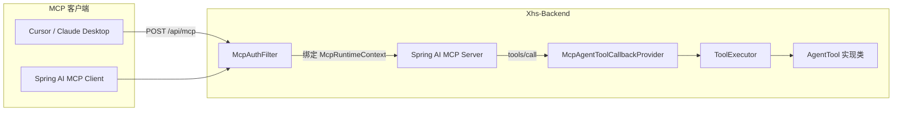

# MCP Server 开发文档

> Model Context Protocol（MCP）让外部 AI 客户端（Cursor、Claude Desktop、Spring AI MCP Client 等）以标准协议调用 XhsAgent 内置运营工具。

## 1. 架构概览



### 核心类说明

| 类 | 职责 |
|----|------|
| `McpAuthFilter` | MCP 端点鉴权（JWT / API Key），绑定线程上下文 |
| `McpRuntimeContext` | ThreadLocal 保存 userId、sessionId、persona |
| `McpAgentToolCallbackProvider` | 将 `AgentTool` 桥接为 Spring AI `ToolCallback`，供 MCP 自动发布 |
| `McpServerConfiguration` | 注册 Filter、条件化启用 MCP 模块 |
| `ToolCallbackConverterAutoConfiguration` | Spring AI 内置：把 `ToolCallback` 转为 MCP `tools/list` |

## 2. 启用方式

### 2.1 application.yml

```yaml
app:
  agent:
    mcp:
      enabled: true
      api-key: your-local-dev-key   # 可选，供无 JWT 的客户端
      exposed-tools:
        - search_kb
        - web_search
        - fetch_url
        - get_hot_topics
        - get_industry_calendar

spring:
  ai:
    mcp:
      server:
        enabled: ${app.agent.mcp.enabled:false}
        protocol: STREAMABLE
        type: SYNC
        streamable-http:
          mcp-endpoint: /mcp
```

环境变量：

| 变量 | 说明 |
|------|------|
| `MCP_SERVER_ENABLED=true` | 开启 MCP Server |
| `MCP_API_KEY=...` | 本地调试 API Key |

### 2.2 端点地址

默认：

- **Base URL**: `http://localhost:8125/api`
- **MCP 端点**: `http://localhost:8125/api/mcp`
- **协议**: Streamable HTTP（Spring AI `protocol: STREAMABLE`）

## 3. 鉴权

### 方式 A：Bearer JWT（推荐）

与 REST API 相同，先登录获取 `accessToken`：

```http
POST /api/v1/auth/login
Content-Type: application/json

{"email":"user@example.com","password":"Test1234"}
```

MCP 请求携带：

```http
POST /api/mcp
Authorization: Bearer <accessToken>
Content-Type: application/json
```

### 方式 B：API Key + User ID（本地调试）

```yaml
app:
  agent:
    mcp:
      api-key: local-mcp-dev-key
```

```http
POST /api/mcp
X-Mcp-Api-Key: local-mcp-dev-key
X-Mcp-User-Id: 1
```

### 可选请求头

| Header | 说明 |
|--------|------|
| `X-Mcp-Session-Id` | 自定义虚拟会话 ID（写入 `agent_tool_log`） |
| `X-Mcp-Persona` | 覆盖人设：`agency` / `mentor` / `senior` |

## 4. 暴露的工具

默认暴露（可在 `app.agent.mcp.exposed-tools` 调整）：

| 工具名 | 说明 | 依赖配置 |
|--------|------|----------|
| `search_kb` | 垂类知识库 RAG 检索 | `app.rag.enabled=true` + reindex |
| `web_search` | Tavily 联网搜索 | `app.agent.tools.web-search=true` + API Key |
| `fetch_url` | 抓取 URL 正文 | `app.agent.tools.fetch-url=true` |
| `get_hot_topics` | 热门选题 | 默认开启 |
| `get_industry_calendar` | 行业日历 | 默认开启 |

工具是否真正可用还受 `app.agent.tools.*` 开关约束；MCP 与 Chat Agent 共用同一套 `AgentTool` 实现。

## 5. Cursor 配置示例

在 Cursor Settings → MCP 中添加（Streamable HTTP）：

```json
{
  "mcpServers": {
    "xhs-agent": {
      "url": "http://localhost:8125/api/mcp",
      "headers": {
        "Authorization": "Bearer <your-access-token>"
      }
    }
  }
}
```

本地 API Key 模式：

```json
{
  "mcpServers": {
    "xhs-agent": {
      "url": "http://localhost:8125/api/mcp",
      "headers": {
        "X-Mcp-Api-Key": "local-mcp-dev-key",
        "X-Mcp-User-Id": "1"
      }
    }
  }
}
```

## 6. 调用链路（tools/call）

1. MCP Client 发送 JSON-RPC `tools/call`，例如调用 `search_kb`：
   ```json
   {
     "name": "search_kb",
     "arguments": {
       "query": "秋招时间线",
       "topK": 5
     }
   }
   ```
2. `McpAuthFilter` 校验身份 → `McpRuntimeContext.bind(...)`
3. `McpAgentToolCallbackProvider` 的 `ToolCallback.call(json)` 解析参数
4. `ToolExecutor.executeDirect` → `SearchKbTool.execute`
5. 返回 JSON 字符串作为 MCP tool result

## 7. 与 Chat Agent 的区别

| 维度 | Chat API | MCP Server |
|------|----------|------------|
| 入口 | `POST /v1/chat/sessions/{id}/messages` | `POST /api/mcp` |
| 编排 | `AgentOrchestrator` 多步 ReAct | 客户端 LLM 决定是否调工具 |
| 会话 | `chat_session` / `chat_message` | 虚拟 sessionId（`mcp_*`） |
| 卡片 | 返回结构化 UI 卡片 | 仅返回 JSON 工具结果 |

## 8. 安全建议

- 生产环境仅使用 **JWT**，关闭或留空 `app.agent.mcp.api-key`
- MCP 端点应置于 HTTPS 反向代理之后
- 通过 `exposed-tools` 最小化暴露面，勿暴露 `analyze_content` 等高成本工具除非必要
- 联网工具受 `UserQuotaService` 配额约束（与 Chat 相同）

## 9. 故障排查

| 现象 | 可能原因 |
|------|----------|
| 401 unauthorized | JWT 过期或未配置 API Key |
| tools/list 为空 | `app.agent.mcp.enabled=false` 或工具在 `app.agent.tools` 中被关闭 |
| search_kb 返回空 | `app.rag.enabled=false` 或知识库未 reindex |
| web_search 走 Mock | 未配置 `WEB_SEARCH_API_KEY` |

## 10. 相关文件

```
Xhs-Backend/src/main/java/.../ai/mcp/
├── McpAuthFilter.java
├── McpRuntimeContext.java
└── McpAgentToolCallbackProvider.java

Xhs-Backend/src/main/java/.../config/
└── McpServerConfiguration.java
```
