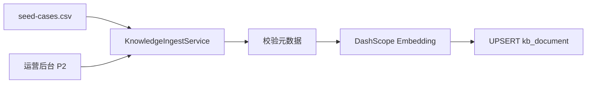

# RAG 知识库设计（PostgreSQL + pgvector）

> 版本：`rag-1.0.0`  
> 依赖：[TECH-ARCHITECTURE.md](./TECH-ARCHITECTURE.md)

---

## 1. 目标

为分析、标题生成、优化建议提供 **可检索的垂类标杆**，使输出可引用、可校准，而非纯 Rubric 硬编码。

---

## 2. 数据模型

表：`kb.kb_document`（见 `db/migration/V1__init_schema.sql`）

| 字段 | 说明 |
|------|------|
| doc_id | 业务 ID，如 `CASE-01` |
| doc_type | viral_case / title_pattern / structure_template / cta_snippet / topic_card |
| content_type | ANXIETY / OFFER / … |
| chunk_type | title / hook / body / cta / full |
| content | 切片文本 |
| metadata | JSONB：scores、tags、persona、structure 摘要 |
| embedding | vector(1024) |
| tsv | 全文检索 |

---

## 3. 入库流程



- 启动脚本：`POST /v1/admin/kb/reindex`（dev only）或 CLI `KbIngestRunner`  
- 正文最长切片建议 ≤ 800 字；标题单独一片  

---

## 4. 检索 API（内部）

```java
public record RagChunk(String docId, String docType, String content,
                       double score, Map<String, Object> metadata) {}

public interface RagRetriever {
    List<RagChunk> retrieve(RagQuery query);
}
```

### RagQuery 参数

| 参数 | 说明 |
|------|------|
| queryText | title + body 前 500 字 |
| docTypes | 限制类型 |
| contentType | 可选过滤 |
| persona | 加权 cta_snippet |
| topK | 默认 5 |

### 混合检索（P2.1）

`finalScore = 0.7 * vectorSim + 0.3 * ts_rank(tsv, query)`

---

## 5. Prompt 注入格式

```text
## 参考案例（仅结构对标，禁止抄袭原文）

[1] OFFER | CTR:90 | 标题:双非逆袭字节...
要点: 结果前置; 六周时间线; CTA 私信【表】

[2] ...

---
```

Token 预算：RAG 上下文 ≤ 2000；不足时优先 `title` + `hook` 切片。

---

## 6. 开关与阶段

```yaml
app:
  rag:
    enabled: false          # P0
    analysis-enabled: false  # P2
    title-enabled: false       # P1
    top-k: 5
```

---

## 7. 评测

- 检索：人工标注 Top5 相关性 ≥ 80%  
- 端到端：seed-cases 20 条，开 RAG 后类型准确率提升或分数偏差下降  
