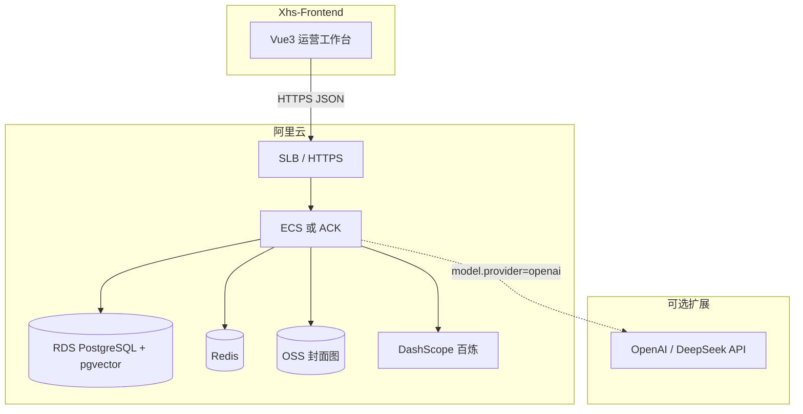
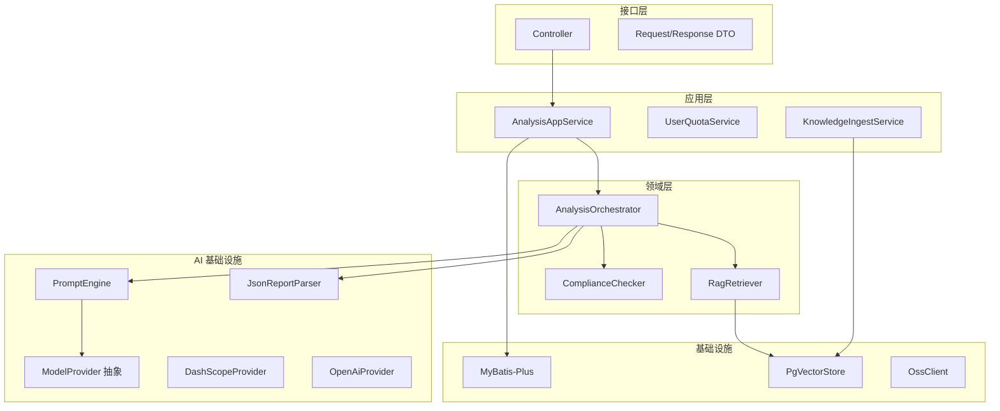
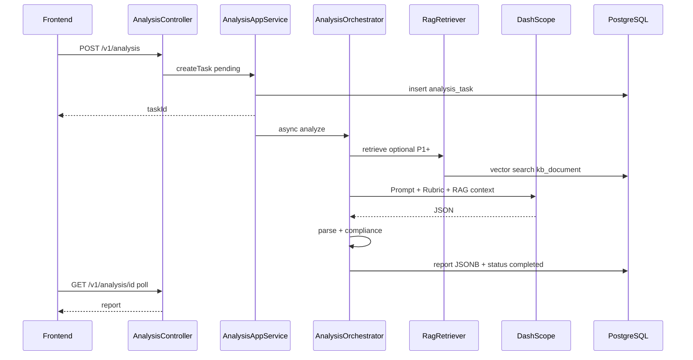

# 技术架构说明书

> 版本：`arch-1.0.0`  
> 日期：2026-05-24  
> 仓库：`Xhs-Backend` + `Xhs-Frontend`

---

## 1. 架构决策（已确认）

| 项 | 决策 |
|----|------|
| 向量库 | **阿里云 RDS PostgreSQL + pgvector**（与业务库同实例，schema 隔离） |
| 主模型 | **阿里云 DashScope（通义千问）**，经 Spring AI Alibaba |
| 扩展模型 | 预留 **OpenAI 兼容** 接口（Spring AI OpenAI / LangChain4j），配置开关切换 |
| 嵌入模型 | DashScope `text-embedding-v3`（维度 1024，以控制台为准） |
| 业务库 | PostgreSQL（RDS） |
| 缓存 | Redis（阿里云 Redis，配额/会话可选） |
| 对象存储 | 阿里云 OSS（生产）/ MinIO（本地 dev） |
| 后端 | Spring Boot 3.5 + Java 21，`XhsAgent-yunying` |
| 前端 | Vue 3 + Vite + TypeScript + Pinia + Element Plus，`Xhs-Frontend` |
| API | REST `/api/v1/*`，契约见 [api-schema](./api-schema/README.md) |

---

## 2. 系统总览



### 2.1 仓库与部署单元

```
XhsAgent/
├── Xhs-Backend/          # Spring Boot 单体（可后续拆 ai-worker）
│   ├── XhsAgent-yunying/
│   ├── docs/
│   ├── db/
│   └── infra/
└── Xhs-Frontend/         # 静态资源 → OSS+CDN 或 Nginx
```

---

## 3. 后端分层架构



### 3.1 包结构

```
com.shortvideoscripagent.xhsagentyunying
├── XhsAgentYunyingApplication.java
├── config/                 # Security, Async, Cors, OSS, AI
├── controller/v1/          # REST
├── dto/                    # 入参出参，对齐 JSON Schema
├── service/                # 应用服务
├── domain/
│   ├── analysis/           # 任务状态机、报告聚合
│   └── compliance/         # 规则引擎
├── ai/
│   ├── model/              # ModelProvider 多模型
│   ├── orchestrator/       # 分析/标题/优化稿编排
│   ├── prompt/             # classpath prompts/*.st
│   ├── parser/             # JSON 校验与重试
│   └── rag/                # 检索与 Context 构建
├── infrastructure/
│   ├── persistence/        # Entity, Mapper
│   ├── vector/             # PgVector 访问
│   └── storage/            # OSS/MinIO
└── common/                 # Result, ErrorCode, Exception
```

---

## 4. 多模型抽象（主阿里云 + 可扩展）

### 4.1 配置模型

```yaml
app:
  ai:
    default-provider: dashscope   # dashscope | openai
    dashscope:
      api-key: ${DASHSCOPE_API_KEY}
      chat-model: qwen-plus
      vision-model: qwen-vl-plus
      embedding-model: text-embedding-v3
    openai:
      enabled: false
      base-url: https://api.openai.com/v1
      api-key: ${OPENAI_API_KEY:}
      chat-model: gpt-4o-mini
```

### 4.2 Java 接口

```java
public interface ModelProvider {
    String id();  // dashscope, openai
    ChatResponse chat(ChatRequest request);
    List<float[]> embed(List<String> texts);
    boolean supportsVision();
}
```

- **P0**：仅实现 `DashScopeModelProvider`（封装 Spring AI `ChatModel` / `EmbeddingModel`）。
- **扩展**：`OpenAiModelProvider` 实现同一接口；`ModelProviderRegistry` 按配置路由。
- 分析任务表记录 `model_provider` + `model_name`，便于审计与 A/B。

---

## 5. 核心链路：内容分析（P0）



| 步骤 | 说明 |
|------|------|
| 异步 | `@Async("analysisExecutor")`，线程池 core=4 max=8 |
| 超时 | 45s，`CompletableFuture.orTimeout` → failed 50401 |
| 解析失败 | JSON Schema 校验失败重试 1 次 |
| RAG | P0 关闭；P1 标题生成开启；P2 分析全量开启 |

---

## 6. PostgreSQL 数据设计

### 6.1 Schema 划分

| Schema | 用途 |
|--------|------|
| `app` | 用户、分析任务、报告、用量 |
| `kb` | RAG 知识库 `kb_document` |

### 6.2 核心表

见 [db/migration/V1__init_schema.sql](../db/migration/V1__init_schema.sql)。

- `app.users` — 账号  
- `app.analysis_task` — 任务与状态  
- `app.analysis_report` — `report_json JSONB`  
- `app.usage_log` — 配额  
- `kb.kb_document` — 切片 + `vector(1024)` + 全文 `tsvector`

### 6.3 阿里云 RDS 注意

1. 选用 **PostgreSQL 14+**（建议 15/16）。  
2. 在控制台或 SQL 执行：`CREATE EXTENSION IF NOT EXISTS vector;`（若 RDS 支持 pgvector；不支持则选用已内置向量能力的 PolarDB/PG 版本）。  
3. 连接池：Hikari `maximum-pool-size=20`。  
4. 迁移：Flyway，`db/migration`。

---

## 7. RAG 知识库（PostgreSQL + pgvector）

详见 [RAG-DESIGN.md](./RAG-DESIGN.md)。

| 阶段 | 行为 |
|------|------|
| P0 | 建表 + seed 导入脚本，检索 `app.rag.enabled=false` |
| P1 | 标题生成检索 `title_pattern` |
| P2 | 分析检索 `viral_case` + 混合检索 |

检索 SQL 示例（余弦相似度）：

```sql
SELECT doc_id, content, metadata,
       1 - (embedding <=> CAST(:queryVec AS vector)) AS score
FROM kb.kb_document
WHERE doc_type = ANY(:types)
  AND (content_type = :ct OR :ct IS NULL)
ORDER BY embedding <=> CAST(:queryVec AS vector)
LIMIT 5;
```

---

## 8. 对象存储（封面）

| 环境 | 方案 |
|------|------|
| local | MinIO，`infra/docker-compose.yml` |
| prod | 阿里云 OSS，私有读 + 预签名 URL（15min） |

流程：`POST /v1/files/cover` → 返回 `coverImageUrl` → 创建分析任务时传入。

---

## 9. 安全与认证

| 项 | P0 方案 |
|----|---------|
| 认证 | JWT（Access 2h + Refresh 7d） |
| 密码 | BCrypt |
| CORS | 允许 `http://localhost:5173`、生产前端域名 |
| 密钥 | 仅环境变量 / 阿里云 KMS，禁止入库 |
| 租户 | 单用户数据 `user_id` 隔离 |

---

## 10. 前端架构（Xhs-Frontend）

### 10.1 技术栈

- Vue 3.5 + TypeScript + Vite 6  
- Pinia（用户、分析任务）  
- Vue Router 4  
- Element Plus + 图标  
- Axios（拦截器统一 `code/message`）  

### 10.2 目录

```
src/
├── api/              # analysis.ts, auth.ts, file.ts
├── assets/
├── components/
│   └── report/       # ScoreCard, IssueList, OptimizePanel
├── composables/      # useAnalysisPoll.ts
├── layouts/          # DefaultLayout.vue
├── router/
├── stores/
├── types/            # 对齐 api-schema
├── utils/
└── views/
    ├── DashboardView.vue
    ├── analysis/
    │   ├── AnalysisNewView.vue
    │   └── AnalysisReportView.vue
    ├── titles/TitlesView.vue
    ├── history/HistoryView.vue
    └── settings/SettingsView.vue
```

### 10.3 与后端协作

| 配置 | 值 |
|------|-----|
| dev proxy | Vite `server.proxy['/api'] -> http://localhost:8125` |
| baseURL | `/api/v1` |
| 轮询 | `useAnalysisPoll(taskId)` 2s × 30 次 |

---

## 11. API 与错误处理

- 统一响应：`{ code, message, data, requestId, timestamp }`  
- 业务码：[error-codes.md](./api-schema/error-codes.md)  
- 文档：Knife4j `http://localhost:8125/api/doc.html`  

---

## 12. 可观测性

| 项 | 实现 |
|----|------|
| 日志 | SLF4J + JSON（prod）；记录 taskId、provider、耗时、promptVersion |
| 链路 | MDC `requestId` |
| 指标 | Micrometer（P1）：分析成功率、P95 延迟、Token 估算 |
| 审计 | `analysis_task.model_provider`, `prompt_version` |

---

## 13. 环境矩阵

| 环境 | 前端 | 后端 | DB | AI |
|------|------|------|-----|-----|
| local | Vite :5173 | :8125 | Docker PG | DashScope |
| dev | 测试域名 | ECS | RDS 测试 | DashScope |
| prod | CDN | ECS/ACK | RDS 生产 | DashScope |

---

## 14. 实施路线图

| 周 | 后端 | 前端 | 数据/AI |
|----|------|------|---------|
| W1 | Flyway、用户 JWT、文件上传、任务 CRUD | 脚手架、登录、新建分析 | Prompt v1、DashScope 联通 |
| W2 | 异步分析、报告 JSON、历史列表 | 报告页五模块、轮询 | seed-cases 评测 |
| W3 | 标题/优化稿、配额 | 抽屉交互 | 标题 Prompt |
| W4 | 合规规则、部署文档 | 工作台、设置 | RAG 表导入（可先不检索） |
| W5+ | RAG 检索接入 | — | P1/P2 按 PRD |

---

## 15. 相关文档

| 文档 | 说明 |
|------|------|
| [PRD-V3.0.md](./PRD-V3.0.md) | 产品需求 |
| [RAG-DESIGN.md](./RAG-DESIGN.md) | RAG 详细设计 |
| [api-schema/](./api-schema/) | 接口契约 |
| [prompt-rubric.md](./prompt-rubric.md) | 评分标准 |
| [infra/README.md](../infra/README.md) | 本地启动 |
