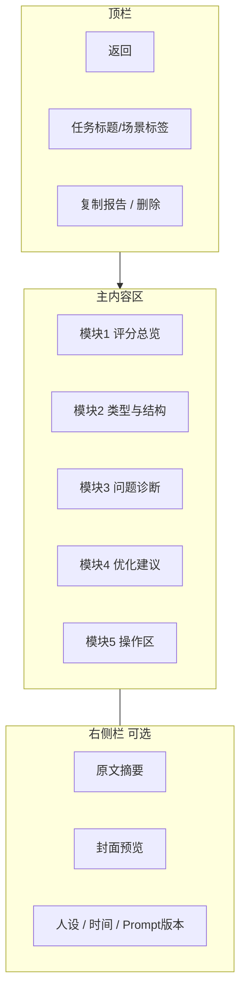

# 核心报告页线框图

## 分析报告页 `/analysis/:id`

> 对应 PRD V3.0 §8.1 固定模块顺序。以下为桌面端主布局（≥1024px）；移动端为单列纵向堆叠。

---

## 1. 页面结构总览



---

## 2. ASCII 线框（桌面 12 列栅格）

```
┌──────────────────────────────────────────────────────────────────────────────┐
│ ← 返回    草稿优化 · 2026-05-24 14:32              [复制报告]  [···]          │
├────────────────────────────────────────────┬─────────────────────────────────┤
│                                            │  原文卡片（折叠）                │
│  ┌──────────────────────────────────────┐  │  ┌───────────────────────────┐  │
│  │ 模块1 · 爆文评分总览                    │  │  │ 标题：海投300份后...        │  │
│  │                                      │  │  │ 正文：前 200 字预览... [展开]│  │
│  │   爆款概率  82  ████████░░  高潜力    │  │  └───────────────────────────┘  │
│  │                                      │  │  [封面缩略图 120×160]            │
│  │  ┌────┐ ┌────┐ ┌────┐ ┌────┐ ┌────┐  │  │  人设：机构号                    │
│  │  │CTR │ │情绪│ │收藏│ │转化│ │综合│  │  │  Prompt: rubric-1.0.0          │
│  │  │ 88 │ │ 76 │ │ 72 │ │ 91 │ │ 82 │  │  └─────────────────────────────────┤
│  │  └────┘ └────┘ └────┘ └────┘ └────┘  │                                    │
│  │  各卡片：分数 + 一句原因（hover 详情）   │                                    │
│  └──────────────────────────────────────┘  │                                    │
│                                            │                                    │
│  ┌──────────────────────────────────────┐  │                                    │
│  │ 模块2 · 内容类型与结构          [展开/收起]│                                    │
│  │  类型标签：[焦虑型] [Offer元素]          │                                    │
│  │  ┌─────────┬─────────┬─────────┐      │                                    │
│  │  │ Hook    │ 情绪曲线 │ 收藏点   │      │                                    │
│  │  │ 2行摘要  │ 简图/文案 │ 列表     │      │                                    │
│  │  └─────────┴─────────┴─────────┘      │                                    │
│  │  转化路径：痛点 → 共鸣 → 案例 → CTA      │                                    │
│  │  CTA 评价：★★★☆☆ 引导偏弱，建议...      │                                    │
│  └──────────────────────────────────────┘  │                                    │
│                                            │                                    │
│  ┌──────────────────────────────────────┐  │                                    │
│  │ 模块3 · 问题诊断（3~8 条）               │                                    │
│  │  🔴 高  标题缺少具体数字与结果对比        │                                    │
│  │  🟡 中  正文干货密度不足，收藏价值偏低     │                                    │
│  │  🟢 低  CTA 未区分人设，咨询引导模糊       │                                    │
│  └──────────────────────────────────────┘  │                                    │
│                                            │                                    │
│  ┌──────────────────────────────────────┐  │                                    │
│  │ 模块4 · 优化建议                        │                                    │
│  │  [标题] [结构] [情绪] [CTA]  Tab        │                                    │
│  │  ─────────────────────────────────     │                                    │
│  │  原：留学生求职经验分享                   │                                    │
│  │  优：海投300份后，我终于知道留学生求职...   │                                    │
│  │  · 增加时间节点（26届秋招）               │                                    │
│  │  · 强化身份标签（海归/藤校/商科）          │                                    │
│  └──────────────────────────────────────┘  │                                    │
│                                            │                                    │
│  ┌──────────────────────────────────────┐  │                                    │
│  │ 模块5 · 操作区（吸底或卡片内固定）         │                                    │
│  │  [生成优化稿]  [生成标题]  [生成正文 P1]   │                                    │
│  │  ⚠ 合规提示：含敏感词「保证上岸」已标黄     │                                    │
│  └──────────────────────────────────────┘  │                                    │
└────────────────────────────────────────────┴─────────────────────────────────┘
```

---

## 3. 模块交互说明

### 3.1 模块1 — 评分总览

| 元素 | 交互 |
|------|------|
| 爆款概率主分 | 大号数字 + 进度条 + 等级文案（低/中/高潜力） |
| 五维小卡 | 点击展开该维度详细 reason |
| 封面未上传 | 顶部 Banner：「上传封面可提升 CTR 分析准确度」 |

### 3.2 模块2 — 类型与结构

| 元素 | 交互 |
|------|------|
| 类型标签 | 主类型 1 个 + 次要标签 0~2 个 |
| 情绪曲线 | 简化为「起→承→转→合」四段文字或迷你折线 |
| 默认状态 | 展开；移动端可默认收起 |

### 3.3 模块3 — 问题诊断

| 元素 | 交互 |
|------|------|
| severity | high / medium / low 对应红/黄/绿 |
| category | ctr / emotion / collect / conversion / compliance |
| 每条 | description + suggestion 两行 |

### 3.4 模块4 — 优化建议

| 元素 | 交互 |
|------|------|
| Tab | 标题 / 结构 / 情绪 / CTA |
| 标题类 | 原句→优化句对比块 |
| 其他类 | 要点列表 |

### 3.5 模块5 — 操作区

| 按钮 | 行为 |
|------|------|
| 生成优化稿 | 打开侧抽屉或跳转子页，展示可编辑全文 + 复制 |
| 生成标题 | 侧抽屉：选择目标类型 → 列表 5–10 条 → 一键复制 |
| 生成正文 | P1 显示；P0 置灰 + Tooltip |

**加载态**：提交后全页 Skeleton；评分先出则分步渲染（可选优化）。

---

## 4. 移动端布局（<768px）

```
┌─────────────────────────┐
│ ←  草稿优化              │
├─────────────────────────┤
│ 爆款概率 82              │
│ [CTR][情绪][收藏][转化]   │  ← 横向滑动
├─────────────────────────┤
│ 原文 [折叠面板]           │
├─────────────────────────┤
│ 模块2~4 纵向堆叠          │
├─────────────────────────┤
│ [生成优化稿]              │  ← 吸底主按钮
│ [标题] [正文灰]           │
└─────────────────────────┘
```

---

## 5. 空态与异常态

| 状态 | 展示 |
|------|------|
| 分析中 | 全页 Skeleton + 「预计 30 秒内完成」 |
| 失败 | 模块区替换为错误卡片 + 重试按钮 |
| 部分失败（如无图 CTR 降级） | 模块1 角标「封面未分析」 |
| 合规拦截 | 模块5 上方红色 Alert，列明触发的规则 |

---

## 6. 优化稿子页 / 抽屉（由模块5触发）

```
┌─────────────────────────────────────┐
│ 优化稿                    [复制] [关闭]│
├─────────────────────────────────────┤
│ ┌─────────────────────────────────┐ │
│ │ 可编辑 Textarea（全文）           │ │
│ └─────────────────────────────────┘ │
│  基于建议版本 · 可继续手动修改          │
│  [重新生成]  [保存到历史]              │
└─────────────────────────────────────┘
```

---

## 7. 设计 Token 建议（供 UI 实现）

| 用途 | 建议 |
|------|------|
| 主色 | 品牌色（小红书系可偏珊瑚红 #FF2442 点缀） |
| 高分 | ≥80 绿色系 |
| 中分 | 60–79 琥珀色 |
| 低分 | <60 红色系 |
| 圆角卡片 | 8px |
| 模块间距 | 24px |
